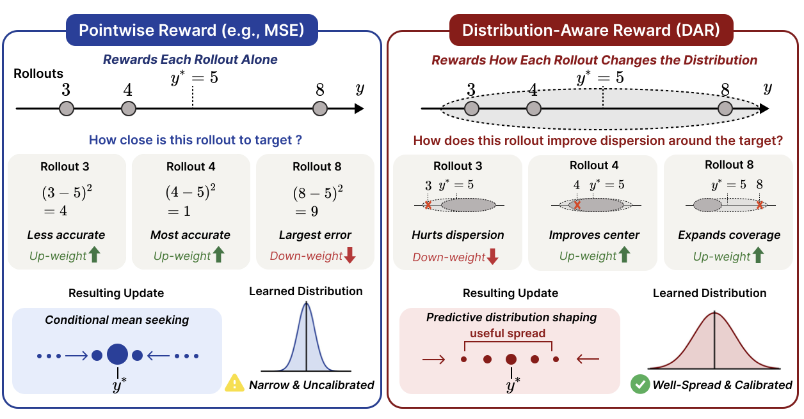

# DAR

Code for **Distribution-Aware Reward (DAR)**, an RL objective for optimizing predictive distributions in LLM regression.

<p align="center">
  
</p>

## Overview

This repository provides the implementation of **Distribution-Aware Reward (DAR)**, a reward formulation designed to improve the quality of predictive distributions generated by large language models for regression tasks.

Unlike pointwise reward objectives that evaluate each prediction independently, DAR evaluates a group of sampled predictions as a distribution. This enables the model to optimize not only prediction accuracy, but also distributional properties such as uncertainty, coverage, and diversity.

The core DAR reward implementation is available at:

[trainer/verl/verl/workers/reward_manager/regression_dar.py](trainer/verl/verl/workers/reward_manager/regression_dar.py)

This repository includes:

- DAR-based reward calculation
- RL training scripts for KBSS and LIPO
- Checkpoint merge scripts for VERL FSDP actor checkpoints
- Evaluation utilities for RL-generated regression predictions

## Installation

This repository is built on top of VERL. For detailed installation instructions, refer to the official VERL documentation:

[VERL installation guide](https://verl.readthedocs.io/en/v0.5.x/start/install.html#install-dependencies)

A minimal setup is:

```bash
conda create -n py310 python=3.10
conda activate py310

git clone https://github.com/JJumSSu/DAR.git
cd DAR/trainer/verl

USE_MEGATRON=0 bash scripts/install_vllm_sglang_mcore.sh
pip install --no-deps -e .
```

Depending on your training environment, you may need to adjust CUDA, PyTorch, vLLM, SGLang, or cluster-specific module settings.

## Data

The training and evaluation scripts expect processed parquet files under `data/` by default.

Expected KBSS files:

```text
data/KBSS_rl_train.parquet
data/KBSS_rl_valid.parquet
data/KBSS_rl_test.parquet
```

Expected LIPO files:

```text
data/LIPO_rl_train.parquet
data/LIPO_rl_valid.parquet
data/LIPO_rl_test.parquet
```

You can override the data location with `DATA_DIR` for scripts, or with `--root-dir` when running the evaluator directly.

## Training

Training scripts are provided for SLURM:

```bash
sbatch scripts/train_kbss.sbatch
sbatch scripts/train_lipo.sbatch
```

The scripts are written to avoid hard-coded user paths. These environment variables can be set before `sbatch` when needed:

```bash
export PROJECT_ROOT=/path/to/DAR
export DATA_DIR=/path/to/data
export CHECKPOINT_DIR=/path/to/checkpoints
export CACHE_DIR=/path/to/huggingface_cache
export CONDA_ENV=py310
```

By default, logging uses console only. To enable Weights & Biases:

```bash
export TRAINER_LOGGER='["console","wandb"]'
export WANDB_MODE=online
export WANDB_API_KEY=your_wandb_key
```

Do not commit API keys or Hugging Face tokens to the repository. If private gated models are used, provide credentials through your shell or cluster secret manager.

## Merge Checkpoints

VERL FSDP actor checkpoints should be merged into Hugging Face format before evaluation.

For KBSS:

```bash
./scripts/merge_kbss.sh
```

For LIPO:

```bash
./scripts/merge_lipo.sh
```

The merge scripts look for checkpoints at:

```text
$CHECKPOINT_DIR/$PROJECT_NAME/$EXPERIMENT_NAME/global_step_*/actor
```

and write merged models to:

```text
global_step_*/hf
```

By default, the original actor `.pt` files are preserved. To delete them after a successful merge:

```bash
DELETE_ACTOR_WEIGHTS_AFTER_MERGE=true ./scripts/merge_kbss.sh
DELETE_ACTOR_WEIGHTS_AFTER_MERGE=true ./scripts/merge_lipo.sh
```

## Evaluation

Run RL-mode evaluation after merging checkpoints.

For KBSS:

```bash
./scripts/evaluate_kbss.sh
```

For LIPO:

```bash
./scripts/evaluate_lipo.sh
```

Useful evaluation overrides:

```bash
export DATA_DIR=/path/to/data
export CHECKPOINT_DIR=/path/to/checkpoints
export PRED_OUTPUT_DIR=/path/to/evaluation_outputs
export N_DECODE=32
export BATCH_SIZE=4096
export TEMPERATURE=1.0
```

To run evaluation directly:

```bash
python3 -m evaluate.run_evaluation \
  --model /path/to/global_step_30/hf \
  --mode rl \
  --task kbss \
  --root-dir /path/to/data \
  --pred_output_dir /path/to/evaluation_outputs
```

For LIPO direct evaluation:

```bash
python3 -m evaluate.run_evaluation \
  --model /path/to/global_step_30/hf \
  --mode rl \
  --task lipo \
  --root-dir /path/to/data \
  --pred_output_dir /path/to/evaluation_outputs
```

## Repository Structure

```text
DAR/
├── evaluate/
│   ├── arguments.py
│   ├── run_evaluation.py
│   └── utils.py
├── scripts/
│   ├── train_kbss.sbatch
│   ├── train_lipo.sbatch
│   ├── merge_kbss.sh
│   ├── merge_lipo.sh
│   ├── evaluate_kbss.sh
│   └── evaluate_lipo.sh
├── trainer/
│   └── verl/
│       └── verl/
│           └── workers/
│               └── reward_manager/
│                   └── regression_dar.py
└── README.md
```

## Citation

If you find this work helpful, please cite our work:

```bibtex
@article{park2026distributionaware,
  title={Distribution-Aware Reward: Reinforcement Learning over Predictive Distributions for LLM Regression},
  author={Park, Jungsoo and Chae, Hyungjoo and Mendes, Ethan and DeYoung, Jay and Kishore, Varsha and Xu, Wei and Ritter, Alan},
  journal={arXiv preprint arXiv:2605.20740},
  year={2026},
  url={https://arxiv.org/abs/2605.20740}
}
```
